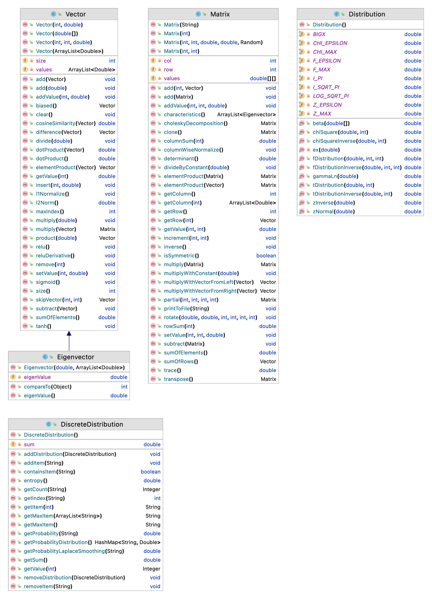

Video Lectures
============

[](https://youtu.be/GhcoaVi0SMs)

For Developers
============

You can also see [Python](https://github.com/starlangsoftware/Math-Py), [Cython](https://github.com/starlangsoftware/Math-Cy), [C++](https://github.com/starlangsoftware/Math-CPP), [C](https://github.com/starlangsoftware/Math-C), [Swift](https://github.com/starlangsoftware/Math-Swift), [Js](https://github.com/starlangsoftware/Math-Js), [Php](https://github.com/starlangsoftware/Math-Php), or [C#](https://github.com/starlangsoftware/Math-CS) repository.

Class Diagram
============



## Requirements

* [Java Development Kit 8 or higher](#java), Open JDK or Oracle JDK
* [Maven](#maven)
* [Git](#git)

### Java 

To check if you have a compatible version of Java installed, use the following command:

    java -version
    
If you don't have a compatible version, you can download either [Oracle JDK](https://www.oracle.com/technetwork/java/javase/downloads/jdk8-downloads-2133151.html) or [OpenJDK](https://openjdk.java.net/install/)    

### Maven
To check if you have Maven installed, use the following command:

    mvn --version
    
To install Maven, you can follow the instructions [here](https://maven.apache.org/install.html).      

### Git

Install the [latest version of Git](https://git-scm.com/book/en/v2/Getting-Started-Installing-Git).

## Download Code

In order to work on code, create a fork from GitHub page. 
Use Git for cloning the code to your local or below line for Ubuntu:

	git clone <your-fork-git-link>

A directory called Math will be created. Or you can use below link for exploring the code:

	git clone https://github.com/olcaytaner/Math.git

## Open project with IntelliJ IDEA

Steps for opening the cloned project:

* Start IDE
* Select **File | Open** from main menu
* Choose `Math/pom.xml` file
* Select open as project option
* Couple of seconds, dependencies with Maven will be downloaded. 


## Compile

**From IDE**

After being done with the downloading and Maven indexing, select **Build Project** option from **Build** menu. After compilation process, user can run Math.

**From Console**

Go to `Math` directory and compile with 

     mvn compile 

## Generating jar files

**From IDE**

Use `package` of 'Lifecycle' from maven window on the right and from `Math` root module.

**From Console**

Use below line to generate jar file:

     mvn install

## Maven Usage

        <dependency>
            <groupId>io.github.starlangsoftware</groupId>
            <artifactId>Math</artifactId>
            <version>1.0.9</version>
        </dependency>

Detailed Description
============

+ [Vector](#vector)
+ [Matrix](#matrix)
+ [Distribution](#distribution)

## Vector

Bir vektör yaratmak için:

	a = Vector(ArrayList<Double> values)

Vektörler eklemek için

	void add(Vector v)

Çıkarmak için

	void subtract(Vector v)
	Vector difference(Vector v)

İç çarpım için

	double dotProduct(Vector v)
	double dotProduct()

Bir vektörle cosinüs benzerliğini hesaplamak için

	double cosineSimilarity(Vector v)

Bir vektörle eleman eleman çarpmak için

	Vector elementProduct(Vector v)

## Matrix

3'e 4'lük bir matris yaratmak için

	a = Matrix(3, 4)

Elemanları rasgele değerler alan bir matris yaratmak için

	Matrix(int row, int col, double min, double max)

Örneğin, 

	a = Matrix(3, 4, 1, 5)
 
3'e 4'lük elemanları 1 ve 5 arasında değerler alan bir matris yaratır.

Birim matris yaratmak için

	Matrix(int size)

Örneğin,

	a = Matrix(4)

4'e 4'lük köşegeni 1, diğer elemanları 0 olan bir matris yaratır.

Matrisin i. satır, j. sütun elemanını getirmek için 

	double getValue(int rowNo, int colNo)

Örneğin,

	a.getValue(3, 4)

3. satır, 4. sütundaki değeri getirir.

Matrisin i. satır, j. sütunundaki elemanı değiştirmek için

	void setValue(int rowNo, int colNo, double value)

Örneğin,

	a.setValue(3, 4, 5)

3. satır, 4.sütundaki elemanın değerini 5 yapar.

Matrisleri toplamak için

	void add(Matrix m)

Çıkarmak için 

	void subtract(Matrix m)

Çarpmak için 

	Matrix multiply(Matrix m)

Elaman eleman matrisleri çarpmak için

	Matrix elementProduct(Matrix m)

Matrisin transpozunu almak için

	Matrix transpose()

Matrisin simetrik olup olmadığı belirlemek için

	boolean isSymmetric()

Determinantını almak için

	double determinant()

Tersini almak için

	void inverse()

Matrisin eigenvektör ve eigendeğerlerini bulmak için

	ArrayList<Eigenvector> characteristics()

Bu metodla bulunan eigenvektörler eigendeğerlerine göre büyükten küçüğe doğru 
sıralı olarak döndürülür.

## Distribution

Verilen bir değerin normal dağılımdaki olasılığını döndürmek için

	static double zNormal(double z)

Verilen bir olasılığın normal dağılımdaki değerini döndürmek için

	static double zInverse(double p)

Verilen bir değerin chi kare dağılımdaki olasılığını döndürmek için

	static double chiSquare(double x, int freedom)

Verilen bir olasılığın chi kare dağılımdaki değerini döndürmek için

	static double chiSquareInverse(double p, int freedom)

Verilen bir değerin F dağılımdaki olasılığını döndürmek için

	static double fDistribution(double F, int freedom1, int freedom2)

Verilen bir olasılığın F dağılımdaki değerini döndürmek için

	static double fDistributionInverse(double p, int freedom1, int freedom2)

Verilen bir değerin t dağılımdaki olasılığını döndürmek için

	static double tDistribution(double T, int freedom)

Verilen bir olasılığın t dağılımdaki değerini döndürmek için

	static double tDistributionInverse(double p, int freedom)

For Contibutors
============

### pom.xml file
1. Standard setup for packaging is similar to:
```
    <groupId>io.github.starlangsoftware</groupId>
    <artifactId>Amr</artifactId>
    <version>1.0.0</version>
    <packaging>jar</packaging>
    <name>NlpToolkit.Amr</name>
    <description>Abstract Meaning Representation Library</description>
    <url>https://github.com/StarlangSoftware/Amr</url>

    <organization>
        <name>io.github.starlangsoftware</name>
        <url>https://github.com/starlangsoftware</url>
    </organization>

    <licenses>
        <license>
            <name>The Apache Software License, Version 2.0</name>
            <url>http://www.apache.org/licenses/LICENSE-2.0.txt</url>
        </license>
    </licenses>

    <developers>
        <developer>
            <name>Olcay Taner Yildiz</name>
            <email>olcay.yildiz@ozyegin.edu.tr</email>
            <organization>Starlang Software</organization>
            <organizationUrl>http://www.starlangyazilim.com</organizationUrl>
        </developer>
    </developers>

    <scm>
        <connection>scm:git:git://github.com/starlangsoftware/amr.git</connection>
        <developerConnection>scm:git:ssh://github.com:starlangsoftware/amr.git</developerConnection>
        <url>http://github.com/starlangsoftware/amr/tree/master</url>
    </scm>

    <properties>
        <maven.compiler.source>1.8</maven.compiler.source>
        <maven.compiler.target>1.8</maven.compiler.target>
        <project.build.sourceEncoding>UTF-8</project.build.sourceEncoding>
    </properties>
```
2. Only top level dependencies should be added. Do not forget junit dependency.
```
    <dependencies>
        <dependency>
            <groupId>io.github.starlangsoftware</groupId>
            <artifactId>AnnotatedSentence</artifactId>
            <version>1.0.78</version>
        </dependency>
        <dependency>
            <groupId>junit</groupId>
            <artifactId>junit</artifactId>
            <version>4.13.1</version>
            <scope>test</scope>
        </dependency>
    </dependencies>
```
3. Maven compiler, gpg, source, javadoc plugings should be added.
```
	<plugin>
		<groupId>org.apache.maven.plugins</groupId>
		<artifactId>maven-compiler-plugin</artifactId>
		<version>3.6.1</version>
		<configuration>
			<source>1.8</source>
			<target>1.8</target>
		</configuration>
	</plugin>
	<plugin>
		<groupId>org.apache.maven.plugins</groupId>
		<artifactId>maven-gpg-plugin</artifactId>
		<version>1.6</version>
		<executions>
			<execution>
				<id>sign-artifacts</id>
				<phase>verify</phase>
				<goals>
					<goal>sign</goal>
				</goals>
			</execution>
		</executions>
	</plugin>
	<plugin>
		<groupId>org.apache.maven.plugins</groupId>
		<artifactId>maven-source-plugin</artifactId>
		<version>2.2.1</version>
		<executions>
			<execution>
				<id>attach-sources</id>
				<goals>
					<goal>jar-no-fork</goal>
				</goals>
			</execution>
		</executions>
	</plugin>
	<plugin>
		<groupId>org.apache.maven.plugins</groupId>
		<artifactId>maven-javadoc-plugin</artifactId>
		<configuration>
			<source>8</source>
		</configuration>
		<version>3.10.0</version>
		<executions>
			<execution>
				<id>attach-javadocs</id>
				<goals>
					<goal>jar</goal>
				</goals>
			</execution>
		</executions>
	</plugin>
```
4. Currently publishing plugin is Sonatype.
```
	<plugin>
		<groupId>org.sonatype.central</groupId>
		<artifactId>central-publishing-maven-plugin</artifactId>
		<version>0.8.0</version>
		<extensions>true</extensions>
		<configuration>
			<publishingServerId>central</publishingServerId>
			<autoPublish>true</autoPublish>
		</configuration>
	</plugin>
```
5. For UI jar files use assembly plugins.
```
	<plugin>
		<groupId>org.apache.maven.plugins</groupId>
		<artifactId>maven-assembly-plugin</artifactId>
		<version>2.2-beta-5</version>
		<executions>
			<execution>
				<id>sentence-dependency</id>
				<phase>package</phase>
				<goals>
					<goal>single</goal>
				</goals>
				<configuration>
					<archive>
						<manifest>
							<mainClass>Amr.Annotation.TestAmrFrame</mainClass>
						</manifest>
					</archive>
					<finalName>amr</finalName>
				</configuration>
			</execution>
		</executions>
		<configuration>
			<descriptorRefs>
				<descriptorRef>jar-with-dependencies</descriptorRef>
			</descriptorRefs>
			<appendAssemblyId>false</appendAssemblyId>
		</configuration>
	</plugin>
```
### Resources
1. Add resources to the resources subdirectory. These will include image files (necessary for UI), data files, etc.
   
### Java files
1. Do not forget to comment each function.
```
    /**
     * Returns the value of a given layer.
     * @param viewLayerType Layer for which the value questioned.
     * @return The value of the given layer.
     */
    public String getLayerInfo(ViewLayerType viewLayerType){
```
2. Function names should follow caml case.
```
    public MorphologicalParse getParse()
```
3. Write toString methods, if necessary.
4. Use Junit for writing test classes. Use test setup if necessary.
```
public class AnnotatedSentenceTest {
    AnnotatedSentence sentence0, sentence1, sentence2, sentence3, sentence4;
    AnnotatedSentence sentence5, sentence6, sentence7, sentence8, sentence9;

    @Before
    public void setUp() throws Exception {
        sentence0 = new AnnotatedSentence(new File("sentences/0000.dev"));
```
